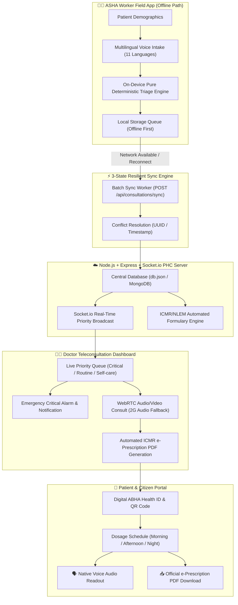

# 🌿 SanjeevaniConnect (संजीवनी कनेक्ट)
### *Offline-First Telemedicine & Deterministic Triage Platform for Rural India*

[](https://opensource.org/licenses/MIT)
[](https://github.com/aravindhrameshkumar879-cse/sanjeevani-final)
[](https://github.com/aravindhrameshkumar879-cse/sanjeevani-final)
[](https://github.com/aravindhrameshkumar879-cse/sanjeevani-final)

---

## 📌 Problem Statement

In rural India, millions of citizens in remote villages lack immediate access to specialist doctors. While telemedicine platforms like *eSanjeevani* exist, they rely on **stable high-speed internet, English/Hindi smartphone literacy, and self-navigation by the patient** — assumptions that fail in rural Sub-Centres where connectivity is intermittent or non-existent.

**SanjeevaniConnect** is designed specifically around how an **ASHA (Accredited Social Health Activist)** worker actually operates:
- **Zero-Internet Path**: 100% on-device demographic intake, multilingual voice symptom recording, and clinical triage decision table calculation.
- **Intermittent Connectivity Tolerance**: 3-state resilient sync engine (`🔴 Offline-only` $\rightarrow$ `🟡 Syncing` $\rightarrow$ `🟢 Synced`).
- **Low-Bandwidth WebRTC**: Sub-Centre video/audio consultations with 2G audio-only fallback mode.
- **ICMR/NLEM Automated e-Prescriptions**: Evidence-based generic drug formulations with 1-click PDF download and vernacular voice readouts in 11 Indian languages.

---

## 🏛️ System Architecture



---

## 🎯 Core Features & Capabilities

### 1. 👩‍⚕️ ASHA Field Worker Mobile App (100% Offline Path)
- **Zero-Latency Pure Deterministic Triage**:
  - `Critical`: Retrosternal chest pain + sweating + age > 40 $\rightarrow$ Immediate ACS Loading Protocol.
  - `Critical`: Severe breathing difficulty OR persistent fever > 3 days $\rightarrow$ High-risk febrile respiratory protocol.
  - `Routine`: Fever < 3 days + cough, no red flags $\rightarrow$ Routine primary consultation.
  - `Self-care`: Mild aches / minor cold, no fever $\rightarrow$ Home care & supportive guidance.
- **11-Indian Language Multilingual Voice Assistant**: Speech recognition & keyword extractor supporting Hindi, Tamil, Telugu, Bengali, Marathi, Gujarati, Kannada, Malayalam, Odia, Punjabi, and English.
- **Outdoor High-Contrast Visibility Mode**: Enhanced visibility under direct sunlight with 48px+ touch targets for rugged field use.
- **Airplane Mode Simulation**: Toggle between Full Offline, 2G Low Bandwidth, and High-Speed Broadband.

### 2. 👨‍⚕️ Doctor Teleconsultation Dashboard
- **Live Socket.io Priority Queue**: Real-time triage updates without page refresh.
- **Audio-Visual Emergency Alarm**: High-priority alert modal with audible siren for critical cardiovascular and respiratory cases.
- **Low-Bandwidth WebRTC Consultations**: Seamless peer-to-peer audio/video with 2G fallback and bandwidth telemetry.
- **Automated ICMR/NLEM Formulary Engine**: Generates evidence-based generic drug regimens, dosages, frequencies, and cautionary red-flag warnings based on patient age and symptoms.

### 3. 👤 Patient & Family Portal
- **Ayushman Bharat Digital Health Card**: Displays patient demographics, unique ABHA ID, and verifiable QR code for PHC pharmacies.
- **1-Click Official e-Prescription PDF Download**: Complete prescription with doctor NMC/MCI registration, generic medicine table, and digital authentication stamp.
- **Multi-Lingual Audio Voice Readout**: Reads aloud medicine dosages and timing instructions in the patient's native mother tongue.

### 4. 🔑 Dedicated Multi-Role Gateway & Registration
- Sleek unified landing gateway with direct selection for **Patient / Citizen** and **Healthcare Staff (Doctor & ASHA)**.
- Full registration modal allowing instant creation and persistence of new Doctor, Patient, and ASHA profiles.

---

## 🧪 Deterministic ICMR Triage Decision Table

| Rule ID | Symptoms & Clinical Red Flags | Age | Priority Tag | Urgency Score | Protocol Action |
| :--- | :--- | :--- | :--- | :--- | :--- |
| `ICMR-CARD-001` | Chest Pain = YES AND Sweating = YES | > 40 yrs | **CRITICAL** | 95 / 100 | Suspected ACS. Stat chewable Aspirin (325mg) + Clopidogrel + 108 Emergency Transit. |
| `ICMR-RESP-002` | Breathing Difficulty = YES | Any | **CRITICAL** | 90 / 100 | Severe respiratory distress. Nebulized bronchodilator + SpO2 monitoring. |
| `ICMR-FEV-003` | Fever = YES AND Fever Duration > 3 days | Any | **CRITICAL** | 85 / 100 | Persistent febrile illness. Send for CBC, Dengue/Malaria card test at PHC. |
| `ICMR-URTI-004` | Fever = YES (<= 3 days) + Cough | Any | **ROUTINE** | 45 / 100 | Uncomplicated viral URTI. Antipyretic + Antihistamine + hydration. |
| `ICMR-SELF-005` | Minor Body Ache / Mild Cold, No Fever | Any | **SELF-CARE** | 15 / 100 | Supportive home remedies, rest, warm hydration. Follow-up with ASHA in 48h. |

---

## 🛠️ Technology Stack

| Layer | Technologies Used |
| :--- | :--- |
| **Frontend** | React 18, Vite, TailwindCSS, Lucide Icons, jsPDF, Web Speech API |
| **Backend Service** | Node.js, Express, Socket.io, WebRTC Signaling |
| **Storage & Persistence** | Offline LocalStorage Engine, SyncQueue Worker, LowDB / JSON Store |
| **Standards & Compliance** | ABDM (Ayushman Bharat Digital Mission), ICMR Clinical Protocols, NLEM Formulary |
| **Testing** | Node Test Runner, Native Integration Suites (`test-e2e.mjs`, `test-triage.js`) |

---

## 🚀 Quick Start Guide (Run Locally)

### Prerequisites
- Node.js (v18 or higher)
- Git

### 1. Clone the Repository
```bash
git clone https://github.com/aravindhrameshkumar879-cse/sanjeevani-final.git
cd sanjeevani-final
```

### 2. Start the Backend Server
```bash
cd server
npm install
npm start
```
*Backend runs on: `http://localhost:5000`*

### 3. Start the Frontend Client
In a new terminal window:
```bash
cd client
npm install
npm run dev
```
*Frontend runs on: `http://localhost:5173`*

---

## ✈️ How to Test the Offline-First Architecture (Demo Walkthrough)

1. Open **`http://localhost:5173`** in your browser.
2. Select **`👩‍⚕️ ASHA App`**.
3. In the top navbar, click **`✈️ Airplane Mode (Offline)`** to simulate zero connectivity.
4. **Register a Patient**:
   - Enter Name: *Kavita Devi*, Age: *48*, Gender: *Female*, Village: *Rampur Khurd*.
   - Check *Chest Pain* and *Sweating*.
   - Observe that **Triage computes instantly on-device** $\rightarrow$ `[ CRITICAL ] (Score: 95/100)`.
   - Click **`💾 Save & Register Patient`**.
5. Check the **Patient Queue**:
   - The case is stored in local storage with status: `🔴 Offline-only`.
6. Click **`🌐 Broadband (Online)`** to restore connectivity:
   - The sync engine instantly wakes up and transitions the case: `🔴 Offline` $\rightarrow$ `🟡 Syncing` $\rightarrow$ `🟢 Synced to PHC`.
7. Switch to **`👨‍⚕️ Doctor Dashboard`**:
   - The critical patient immediately pops up with an audible siren and emergency loading protocol!
8. Click **`📝 Prescribe / e-Rx`** $\rightarrow$ Click **`Save & Issue e-Prescription`**.
9. Switch to **`👤 Patient Portal`**:
   - Download the official signed **e-Prescription PDF** and click **`🗣️ Listen in Audio`** to hear dosage instructions in Hindi/Tamil/English!

---

## 🧪 Running Unit & Integration Tests

```bash
# Run deterministic triage rule engine unit tests
cd client
node test-triage.js

# Run full end-to-end backend sync and AI formulary tests
cd ..
node test-e2e.mjs
```

---

## 📜 License

This project is licensed under the MIT License — see the [LICENSE](LICENSE) file for details.

---

<p align="center">
  <b>SanjeevaniConnect</b> • <i>Bridging Every Rural Village to Specialist Healthcare</i> 🌿
</p>
